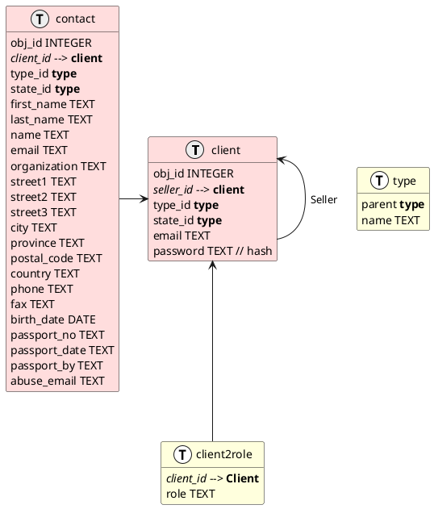

```plantuml
@startuml

!define Entity(name,desc) class name as "desc" << (T,#EEEEEE) >> #FFDDDD
!define ValueObject(name,desc) class name as "desc" << (T,#FFFFFF) >> #DDFFDD
!define Auxiliary(name,desc) class name as "desc" << (T,#FFFFFF) >> #FFFFDD
!define Link(name,desc) class name as "desc" << (T,#FFFFFF) >> #FFFFDD
!define primary_key(x) x INTEGER
!define foreign_key(x, y) <i>x</i> --> <b>y</b>
!define value_object(x, y) x <b>y</b>
hide methods
hide stereotypes

Entity(client, "client") {
    primary_key(obj_id)
    foreign_key(seller_id, client)
    value_object(type_id, type)
    value_object(state_id, type)
    email TEXT
    password TEXT // hash
}

Entity(contact, "contact") {
    primary_key(obj_id)
    foreign_key(client_id, client)
    value_object(type_id, type)
    value_object(state_id, type)
    first_name TEXT
    last_name TEXT
    name TEXT
    email TEXT
    organization TEXT
    street1 TEXT
    street2 TEXT
    street3 TEXT
    city TEXT
    province TEXT
    postal_code TEXT
    country TEXT
    phone TEXT
    fax TEXT
    birth_date DATE
    passport_no TEXT
    passport_date TEXT
    passport_by TEXT
    abuse_email TEXT
}

Auxiliary(client2role, "client2role") {
    foreign_key(client_id, Client)
    role TEXT
}

Auxiliary(type, "type") {
    value_object(parent, type)
    name TEXT
}

client -up-> client : Seller

client2role -up-> client

contact -right-> client

@enduml
```
